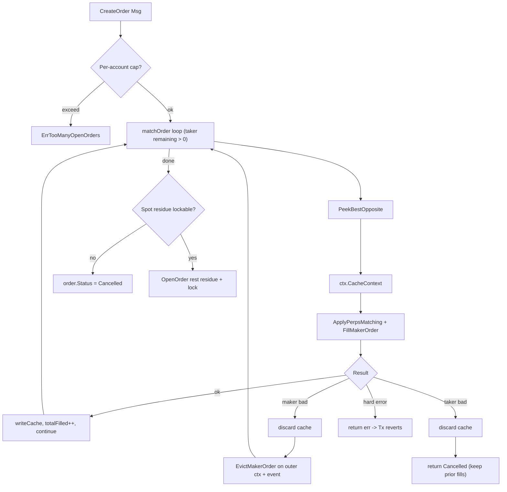

# Matching / Trade Lighter Alignment

本次改造把 `x/matching` + `x/trade` + `x/orderbook` 的两个核心问题与 lighter 行为对齐：

1. **撮合到坏 maker 不再卡住整笔 Tx**：使用 `ctx.CacheContext()` 局部回滚，soft 错误 evict + continue。
2. **挂单不再无门槛**：spot 启用真实 `LockedBalance` 锁仓；perp 引入 `Market.MaxOpenOrdersPerAccount` 计数上限。

## 1. 错误分类（`x/trade/types/errors.go`）

| Sentinel | 触发条件 | 撮合循环动作 |
| --- | --- | --- |
| `ErrMakerRiskRegression` | maker post-trade `IsValidRiskChange` 失败 | evict maker + continue |
| `ErrMakerInsufficientBalance` | spot maker 没有足够 balance | evict maker + continue |
| `ErrTakerRiskRegression` | taker post-trade 风险失败 | 终止 taker（保留已 fill） |
| `ErrTakerInsufficientBalance` | spot taker available 不足 | 终止 taker（保留已 fill） |
| 其它 (`fmt.Errorf` / funding / bank / collections) | 不可恢复 | 整笔 Msg revert |

辅助函数：`IsRecoverableMakerError(err)`、`IsRecoverableTakerError(err)`，`matchOrder` 用 `errors.Is` 一并匹配。

## 2. cacheCtx 局部回滚（`x/matching/keeper/match.go`）

每次撮合一个 maker 时：

```go
sdkCtx := sdk.UnwrapSDKContext(ctx)
cacheCtx, writeCache := sdkCtx.CacheContext()
applyErr := k.tradeKeeper.ApplyPerpsMatching(cacheCtx, fill)
if applyErr == nil {
    _, applyErr = k.bookKeeper.FillMakerOrder(cacheCtx, best.OrderIndex, tradeBase)
}
switch {
case applyErr == nil:
    writeCache()
    // 累计 totalFilled / fills, emit order_fill
case tradetypes.IsRecoverableMakerError(applyErr):
    // 丢弃 cache, 在 outer ctx 上 EvictMakerOrder + continue
case tradetypes.IsRecoverableTakerError(applyErr):
    // 丢弃 cache, 终止 taker
case default:
    // hard error → return err 整笔回滚
}
```

### 取舍说明

- **为什么用 cacheCtx 而不是手工还原状态？** `ApplyPerpsMatching` 内部对 funding settle、position、entry quote、collateral、OI、treasury 等 5 处以上做了写入，手工反算极易遗漏。`cacheCtx` 利用 SDK 的 `CacheMultiStore` 直接丢弃所有写入，类型安全且零遗漏。
- **性能开销**：每次撮合多一次 cache 创建与 commit。`MaxFillsPerMsg` 默认数十级，单 Tx 创建几十个 cache 在 cosmos 链上是可接受成本（已有 staking 等模块大量使用）。后续如有性能需要可改成「按 maker 失败回滚」的批量方案，但语义会更复杂。
- **taker 坏时为什么强制 cancel 残量？** lighter `cancel_taker_order` 一定 pop register。我们如果让残量进 `OpenOrder` Open 路径，下一个 taker 撞上来还是同样失败，反而把毒挂单种到 book 头部。强制 Cancelled 是更安全的语义。

## 3. EndBlocker / Trigger 兼容性

`x/matching/keeper/abci.go` 的 trigger 激活路径调用同一个 `matchOrder`。
- maker soft error 自动 evict + continue，对 abci 透明。
- taker soft error 返回 `(filled, OrderStatusCancelled, nil)`，落到 `OpenOrder(Cancelled)` 走 terminal 分支，不会试图把残量挂到 trigger book 上。
- hard error 仍由 abci 现有 `CancelOrder` 收口逻辑处理。

## 4. Spot Lock-on-place

### account keeper API（`x/account/keeper/account.go`）
- `IncreaseLockedBalance(accIdx, assetIdx, amount)`：校验 `Available = Balance - LockedBalance >= amount`，否则返回 `ErrInsufficientFunds`。
- `DecreaseLockedBalance(accIdx, assetIdx, amount)`：lock 不足时 clamp 到 0。
- `AvailableBalance(accIdx, assetIdx)`：负值返回 0。

### orderbook 接入（`x/orderbook/types/expected_keepers.go`）
新增 `SpotLocker` 接口仅暴露上述两个方法；orderbook keeper 持有该接口实例（由 `app/keepers` 注入 `PerpAccountKeeper`）。

### lifecycle 联动（`x/orderbook/keeper/lifecycle.go`）
- `OpenOrder`：spot 市场 + Open/PartiallyFilled → `applySpotLockOnOpen` 先锁仓再插 entry，lock 失败拒挂。
- `CancelOrder` / `EvictMakerOrder`：根据 `RemainingBaseAmount + Price + IsAsk + market.{Base,Quote}AssetId` 计算还在锁的部分，调 `releaseSpotLockOnClose`。
- `FillMakerOrder`：不主动 release。lock 是在 `ApplySpotMatching.spotMakerDebit` 中按 fill 量同步扣的。

### trade 应用调整（`x/trade/keeper/keeper.go`）
- `spotMakerDebit`：`lockedDrain = min(amount, LockedBalance)`，先扣 lock 再扣 balance；balance 不足返回 `ErrMakerInsufficientBalance`。
- `spotTakerDebit`：直接对 `Available` 校验，不扣 lock；不足返回 `ErrTakerInsufficientBalance`。
- 这两个 helper 替代了原来的 `transferAsset`（删除）。

### CreateOrder 预校验（`x/matching/keeper/msg_server.go`）
撮合后挂单前，spot 限价非 IOC 时若 `Available < lockNeeded` 直接把 `order.Status = Cancelled` + 发事件 `order_residue_unlockable`，不调 OpenOrder 的 lock 路径，**保留已成交部分**。这样避免 lock 失败 revert 整 Tx 把已 fill 也回滚。

## 5. Perp 开放订单上限

### proto 字段（`proto/perpdex/market/v1/market.proto`）
```
uint32 max_open_orders_per_account = 16; // 0 = no limit
```

### 计数器存储（`x/orderbook/keeper/orderbook.go`）
新增 `AccountOpenOrderCount: collections.Map[Pair[uint64, uint32], uint32]`。维护点：
- `indexAccountOpenOrder`：若 KeySet 之前没记，+1（避免 ActivateTrigger → OpenOrder 二次重入时重复 +1）。
- `unindexAccountOpenOrder`：若 KeySet 还有，-1，clamp 到 0；为 0 时 remove 掉空行。

### CreateOrder 校验（`x/matching/keeper/msg_server.go`）
Trigger / 非 IOC 限价 (`willConsumeOpenSlot`) 在撮合前检查 `count < cap`，否则返回 `ErrTooManyOpenOrders`。IOC 不计 cap（不会留挂）。

## 6. 清算 / NoRiskCheck 路径

`Fill.NoRiskCheck=true` 跳过 risk 检查，所以不会走 sentinel；`SkipMakerRiskCheck=true` 仅跳过 maker risk，taker 仍可能产生 `ErrTakerRiskRegression`。清算 keeper 当前调用方式无改动，行为保持。

## 7. 与 lighter 行为差异（仍存在的）

- 单次 `matchOrder` 内部循环跨多档（`MaxFillsPerMsg`），lighter 用 `register_stack` 跨多 tx 串联。结果一致，但延迟特征不同。
- `MaxFillsPerMsg` 达到上限的剩量按 PartiallyFilled 挂回 book，lighter 把 register 留下让下一笔 tx 继续。语义等价。
- spot taker 不锁仓（IOC 路径），与 lighter 一致。
- perp 仍未引入「per-order reserved margin」，仅做计数限制；如未来需要更严格 risk 控制可再加。

## 8. 测试覆盖

| 模块 | 文件 | 关键场景 |
| --- | --- | --- |
| matching | [`x/matching/keeper/match_recovery_test.go`](../x/matching/keeper/match_recovery_test.go) | 单/多坏 maker evict + continue；坏 taker 保留已 fill；hard error revert；perp cap；IOC 绕过 cap |
| orderbook | [`x/orderbook/keeper/spot_lock_test.go`](../x/orderbook/keeper/spot_lock_test.go) | spot ask/bid lock；partial fill 后 cancel 释放残量；locker 拒绝阻止挂单；count lifecycle |
| trade | [`x/trade/keeper/sentinel_test.go`](../x/trade/keeper/sentinel_test.go) | 4 个 sentinel 各自 `errors.Is` 命中；spot debit 优先扣 lock；hard error 分类正确 |

全量 `go test ./...` PASS。

## 9. 数据回滚边界图


