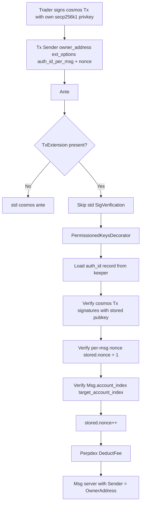

# 三个候选方向对比

经几轮讨论已经锁定的硬约束（不再讨论）：

- API key 绑定粒度 = `account_index`（master 或 sub）
- 业务 nonce 自维护 `(account_index, api_key_index) → nonce`，不复用 cosmos sequence
- 手续费从 API key 绑定的 subaccount `Account.Collateral` 扣 USDC
- 业务 Msg 应有统一接口抽象（zk-dex `dispatch_tx!` 的等价物）
- scope / 过期 / last_used_at 走最小化（minimal）

下面三个方向都能满足这些硬约束，差别在**架构抽象层级 / 客户端体验 / 工作量 / 未来可扩展性**。

## 候选 A — 完整移植 dydx v4 `x/accountplus` 框架

### A.1 概述

把 dydx v4 `protocol/x/accountplus` 整个目录（含 authenticator 子包）port 进来，形成 perpdex 的 `x/accountplus` 模块。

引入：

- `AuthenticatorManager`（注册 type）
- `Keeper`（维护 (owner, auth_id, type, config)）
- 5-hook `Authenticator` interface
- 子节点：`SignatureVerification` / `AllOf` / `AnyOf` / `MessageFilter`，可选 `CosmwasmAuthenticator`
- `MsgAddAuthenticator` / `MsgRemoveAuthenticator`
- `TxExtension { selected_authenticators }` proto
- 自定义 ante（替代 cosmos `SigVerificationDecorator`）+ post-handler

perpdex 特化：

- 新增 `PerpdexNonceTrackerAuthenticator` 子节点：在 `Track`/`ConfirmExecution` 里维护 `(owner, auth_id) → nonce`（独立于 cosmos sequence）。
- 新增 `AccountIndexAuthenticator` 子节点：从 Msg 抽 `account_index`，校验它属于 owner 名下、且 fee 应从该 subaccount.Collateral 扣。
- 修改 smart-account 的 fee deduct 路径：从 `account.Collateral` 扣 USDC。

### A.2 优点

- 与 dydx / Osmosis 生态对齐，未来可直接接 `CosmwasmAuthenticator`、`AuthnVerification` (passkey) 等。
- 权限 scope 极强：`AllOf(SigVerify, MessageFilter, SubaccountFilter, ClobPairIdFilter, SpendLimitContract)` 任意组合。
- 已被 osmosis / dydx 多年生产验证。

### A.3 代价

- 工作量 ~3000-5000 LoC（一整个模块）。
- 与 perpdex 当前极简风格偏离（learning curve、维护成本）。
- 引入复杂概念：post-handler、track 与 confirm 的可见性差异、composite id (`86.1.0`)、unauthenticated gas 限制。
- 与 zk-dex/lib 风格相去甚远（zk-dex 没有 authenticator 树，只有简单 Ed25519+nonce）。

### A.4 适用场景

如果 perpdex 长远要支持复杂的"机构客户委托给做市商 / 风控合同 / 多签 cosigner / 钱包恢复"等场景，A 是终局答案。

---

## 候选 B — **精简版 dydx 风格（推荐）**

### B.1 概述

不引入 dydx 的完整框架，自研 perpdex `x/permissioned_keys` 模块，**借鉴 dydx 的核心设计哲学**：

- **trader 在链上没有地址账户**——所有元数据挂在 owner（即 `Account.OwnerAddress`）下。
- **Tx 通过 `TxExtension` 携带 `auth_id`**：客户端用 trader 私钥签 cosmos Tx，`Msg.Sender` 仍填 `account.OwnerAddress`。
- **自定义 ante 替代 cosmos `SigVerificationDecorator`**：根据 extension 加载 stored trader pubkey 验签；无 extension 时退回 cosmos 标准 path。

但**只支持两种 authenticator**：

- `SignatureVerification(traderPubKey)`（必带）
- `SubaccountFilter(account_index)`（限定 trader 只能动这个 perpdex account）

不引入 `AllOf` / `AnyOf` / `MessageFilter` / `CosmwasmAuthenticator`。每个 `Authenticator` 记录的形态固定为：

```proto
message ApiKey {
  uint64 owner_account_index = 1;  // 颁发者 = master.account_index（或任何持有 OwnerAddress 的账户）
  uint64 target_account_index = 2; // trader 能动的 perpdex account（subaccount 视角）
  uint32 api_key_index = 3;        // 0..254
  google.protobuf.Any pub_key = 4; // cosmos secp256k1
  uint64 nonce = 5;                // 业务 nonce
  int64  created_at = 6;
}
```

### B.2 鉴权流程



要点：

1. Msg.Sender 仍是 `OwnerAddress`，msg_server 内的 `IsAuthorized(sender, account_index)` 完全不动。
2. ante 在 cosmos `SigVerification` 之前 / 替换之，根据 `TxExtension` 决定走 trader pubkey 还是 owner pubkey。
3. Msg 改造**只增加新字段** `nonce`（为了让业务 nonce 进入 SignDoc 自然被签名覆盖；`account_index / api_key_index` 由 ext 携带 + Msg 已有 `account_index`）。或者更激进：让 `nonce` 也放在 TxExtension 里，**Msg proto 完全不动**。
4. fee 从 `target_account_index.Collateral` 扣 USDC（替换 cosmos `DeductFeeDecorator`）。

### B.3 优点

- **trader 无链上地址** → 不需要 prefix 区分、不需要 bank SendRestriction、不需要给 trader 地址充 gas。
- **现有 Msg proto 不动 / 仅 TxExtension 加字段**（最干净）。
- **fee 自然走 collateral**：fee payer 路径只要看 ext 里登记的 `target_account_index`。
- **zk-dex 风格 nonce 保留**：业务 nonce per `(owner, api_key_index)`，撤销 = 删 KV。
- 复杂度可控（~1500-2000 LoC）。

### B.4 代价

- 自研模块（不直接复用 dydx 代码，需自己实现 5 个 hook 的简化版）。
- 未来要扩展 `MessageFilter` / `Cosmwasm`，需要自己重新写 / 升级到方案 A。
- 客户端 SDK 需要为 cosmos TxBuilder 注入 `tx_extension_options`，不能完全直接使用 Keplr/Leap 默认流程（需要钱包扩展）。

### B.5 适用场景

- perpdex 短期内只需要"trader 代发交易 + 限定操作哪个 subaccount"。
- 想保留 zk-dex 简洁语义但又不愿意为派生地址做 prefix/SendRestriction 的折腾。
- 未来需要更细 scope 时，能渐进升级到方案 A。

---

## 候选 C — zk-dex 风格 + cosmos 派生地址

### C.1 概述

之前已经在 [`proposal_zkdex_style.md`](./proposal_zkdex_style.md) 详细写过。要点：

- API key 是 cosmos secp256k1 PubKey，对应 cosmos 派生地址（`px1...`）。
- 现有 Msg proto 加 `api_key_index / nonce` 字段，所有用户 Msg 实现 `ApiKeyAuthMsg` 接口。
- 客户端用标准 cosmos TxBuilder（Keplr/Leap 兼容），用 trader 私钥签整个 Tx。
- ante 链：标准 SDK SigVerification + 新 `ApiKeyAuthDecorator`（业务 nonce 校验）+ 自定义 `DeductFeeDecorator`（从 collateral 扣）。
- bank `AppendSendRestriction` 禁止任意人向 API key 派生地址转账。
- 业务展示层用 `pxapi1...` 前缀编码（链上 wire 仍 `px1...`）。

### C.2 优点

- 与 zk-dex/lib 1:1 对齐（`(account, key)` 槽位、业务 nonce、minimal scope）。
- 客户端体验最好：完全标准 cosmos TxBuilder，钱包零改动。
- 工作量最小（~1000-1500 LoC）。

### C.3 代价

- API key 派生地址会被 cosmos AccountKeeper 建 BaseAccount（只存 pubkey + sequence，balance 永远 0）——cosmos side state。
- 必须做 bank SendRestriction 防误转（不复杂但是负担）。
- 必须做 prefix 区分（业务展示层）以免在 explorer / wallet 里看不出哪些地址是 API key。
- 现有所有用户 Msg proto 都要加字段（不破坏字段编号但提交面广）。

### C.4 适用场景

- 想最快落地、与 zk-dex 1:1 对齐、不打算引入 dydx 风格的扩展能力。

---

## 三方案矩阵

| 维度 | A. 完整 dydx | B. 精简 dydx | C. zk-dex 派生地址 |
|---|---|---|---|
| trader 链上账户 | 无 | 无 | 有（cosmos BaseAccount） |
| 现有 Msg proto 改动 | 不动 | 不动（或仅加 nonce） | 加 `api_key_index/nonce` 字段 |
| 现有 `IsAuthorized` 改动 | 不动 | 不动 | 加 ApiKey 反向查找通路 |
| 验签密钥来源 | smart-account keeper | permissioned_keys keeper | cosmos AccountKeeper |
| nonce 模型 | owner.Sequence 默认 + perpdex 自加子节点 | per (owner, auth_id) | per (account, key) |
| fee 来源 | 默认 owner.Bank（要改 → collateral） | collateral | collateral |
| prefix 区分 | 不需要 | 不需要 | 需要（pxapi 视觉层） |
| bank SendRestriction | 不需要 | 不需要 | 需要 |
| 客户端钱包 | 需要扩展支持 TxExtension | 需要扩展支持 TxExtension | 标准 cosmos TxBuilder |
| 权限 scope | 树状自由组合 | SubaccountFilter only | minimal（无） |
| 未来扩展能力 | ★★★★★ | ★★★ | ★ |
| 工作量（估算） | 3000-5000 LoC | 1500-2000 LoC | 1000-1500 LoC |

## 当前推荐：方案 B

理由：

1. **零侵入现有 Msg / IsAuthorized**：保留 perpdex 当前极简风格。
2. **trader 无链上地址**：彻底避免 prefix 区分、SendRestriction 等"派生地址"的负担。
3. **保留 zk-dex 业务 nonce 与 collateral fee 语义**：不被 dydx 默认的 owner.Sequence + owner.Bank 绑架。
4. **未来若需复杂 scope，可平滑升级到 A**（accountplus 模块）。
5. 复杂度比 A 显著低（不引入 5-hook 接口、组合 authenticator、post-handler）。

如果近期只是"快速落地最小可用"，可以走 C 起步，未来重构到 B/A。
