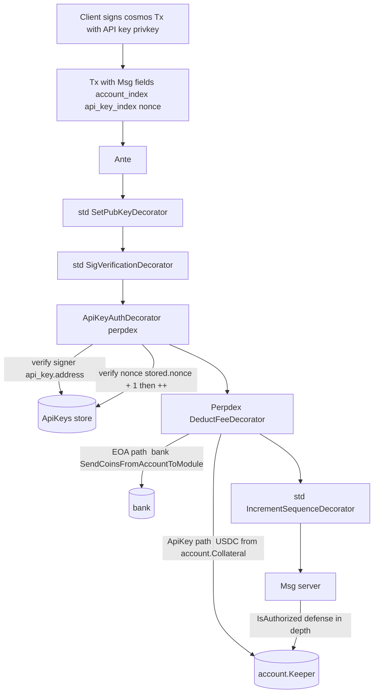

# 方案 C 详细设计稿（zk-dex 风格 + cosmos 派生地址）

> 状态：与 [`alternatives.md`](./alternatives.md) 中的 "候选 C" 对应。
> 之前在 `.cursor/plans/perpdex_subaccount_api_keys_4f0b682a.plan.md` 中沉淀过；此处作为方向 C 的实现稿沉淀，便于后续如果选 C 直接执行。

## 1. 设计总览

### 1.1 与 zk-dex/lib 的语义对齐

| zk-dex/lib | perpdex-l1（方案 C） |
|---|---|
| `ApiKey { api_key_index, public_key (Ed25519), nonce }` | `ApiKey { account_index, api_key_index, address, pub_key (cosmos Any), nonce }` |
| `(owner_account_index, api_key_index)` 槽位隔离 | `(account_index, api_key_index)` 主键隔离 |
| L2 tx payload Keccak256 + Ed25519 验签 | cosmos Tx.SignDoc + secp256k1（复用 SDK SigVerificationDecorator） |
| `state.api_key.nonce` 自维护，每笔 ++ | perpdex 自维护 `(account, key) → nonce`，ante 校验 + ++ |
| `L2ChangePubkeyTx` 新 key 自签 / `L1ChangePubkeyTx` EOA 签 | `MsgRegisterApiKey/RotateApiKey/RevokeApiKey` 由 `account.OwnerAddress` 签 |
| `verify_l2_sender_role` 限定 sub 能发哪些 tx 类型 | 不显式限制 tx 类型；护栏靠 Deposit 拒绝 + bank SendRestriction |
| 撤销 = 写空 public_key | 撤销 = 删 KV |

### 1.2 整体流程



### 1.3 关键设计决策

- **API key 绑在 `account_index`（不是 master_account_index）**：每个 account（master 或 sub）独立颁发自己的 API key 集合；nonce 与 fee 都按 account_index 自然隔离。
- **复用 cosmos Tx.Signatures**：客户端用标准 cosmos TxBuilder，用 API key 私钥签整个 Tx。SDK `SigVerificationDecorator` 自动验签，pubkey 由 `SetPubKeyDecorator` 首次写入 cosmos AccountKeeper。
- **业务 nonce 自维护**：cosmos sequence 仍按 SDK 默认在 BaseAccount 上递增（无业务意义），业务防重放走 perpdex 自己的 `(account, api_key_index) → nonce`。Msg 显式带 `nonce` 字段，ante 校验单调递增。
- **fee 从 collateral 扣**：API key 派生地址永远 0 余额。fee denom 必须是 USDC；`DeductFeeDecorator` 按 `account_index` 从 `Account.Collateral` 扣 USDC，写入 `auth.FeeCollectorName` 模块账户。
- **专属前缀 `pxapi1...`（视觉层）**：cosmos sdk bech32 prefix 全局唯一，wire format 仍 `px1...`。perpdex 业务层（query 响应、event、CLI 输出）把 API key 地址重新编码为 `pxapi1...`。
- **bank SendRestriction 禁转账**：`bankKeeper.AppendSendRestriction(fn)`，若 `to` 在 `ApiKeyByAddress` 命中，return error。

## 2. 数据模型

### 2.1 ApiKey 结构

新增 `proto/perpdex/account/v1/api_key.proto`：

```proto
message ApiKey {
  uint64 account_index = 1;        // 绑定到哪个 perpdex account（master 或 sub 都行）
  uint32 api_key_index = 2;        // 0..254，255 = NIL
  string address = 3;              // bech32 px1... wire format
  google.protobuf.Any pub_key = 4; // cosmos secp256k1 PubKey
  uint64 nonce = 5;                // 业务 nonce
  int64  created_at = 6;
}
```

### 2.2 Store

`x/account/types/keys.go` 新增前缀：

```go
ApiKeysKey            = []byte{0x10} // (accountIdx, keyIdx) -> ApiKey
ApiKeyByAddrKey       = []byte{0x11} // address(string) -> (accountIdx, keyIdx)
NilApiKeyIndex uint32 = 255
```

`x/account/keeper/keeper.go` 加：

```go
ApiKeys         collections.Map[collections.Pair[uint64, uint32], types.ApiKey]
ApiKeyByAddress collections.Map[string, collections.Pair[uint64, uint32]]
```

新增 `x/account/keeper/api_key.go`：

- `RegisterApiKey(ctx, accountIdx, keyIdx, pubKeyAny) error`
- `RotateApiKey(ctx, accountIdx, keyIdx, newPubKeyAny) error`（nonce 重置 0）
- `RevokeApiKey(ctx, accountIdx, keyIdx) error`
- `LookupApiKey(ctx, addr) (accountIdx, keyIdx, found)`
- `GetApiKey(ctx, accountIdx, keyIdx) (ApiKey, error)`
- `IncrementApiKeyNonce(ctx, accountIdx, keyIdx) error`
- `IsApiKeyAddress(ctx, addr) bool`

## 3. ApiKeyAuthMsg 接口与 Msg 改造

### 3.1 接口

新增 `types/api_key_msg.go`：

```go
const NilApiKeyIndex uint32 = 255

type ApiKeyAuthMsg interface {
    sdk.Msg
    GetAccountIndex() uint64
    GetApiKeyIndex() uint32  // NilApiKeyIndex(255) = EOA fallback
    GetApiKeyNonce() uint64
}
```

### 3.2 现有 Msg 改造

`proto/perpdex/account/v1/tx.proto` / `proto/perpdex/matching/v1/tx.proto` / `proto/perpdex/liquidation/v1/tx.proto` 中所有 "代表 account 操作" 的 Msg 追加：

```proto
uint32 api_key_index = N;
uint64 nonce         = N+1;
```

涉及的 Msg：

- `x/account`: `MsgWithdraw`, `MsgCreateSubAccount`, `MsgUpdateAccountConfig`, `MsgUpdateAccountAssetConfig`, `MsgTransfer`, `MsgUpdateMargin`, `MsgUpdateLeverage`
- `x/matching`: `MsgCreateOrder`, `MsgCancelOrder`, `MsgModifyOrder`, `MsgCancelAllOrders`
- `x/liquidation`: `MsgLiquidate`, `MsgDeleverage`

不改造（不实现 `ApiKeyAuthMsg`）：

- `MsgDeposit` — 直接动 cosmos bank balance，必须 EOA。
- `x/account` `MsgRegisterApiKey/RotateApiKey/RevokeApiKey` — 必须 OwnerAddress EOA 签。
- 治理 Msg / oracle 模块 Msg。

每个 Msg 在 Go 层加 `GetAccountIndex/GetApiKeyIndex/GetApiKeyNonce` 三方法。

### 3.3 兼容性：NIL 路径

`api_key_index = 255` → ante 跳过 nonce 校验，走 EOA fallback；`IsAuthorized` 老路径继续生效。旧客户端只要把字段补 0/255 即可。

## 4. 三个新 Msg（API key 管理）

```proto
rpc RegisterApiKey(MsgRegisterApiKey) returns (MsgRegisterApiKeyResponse);
rpc RotateApiKey  (MsgRotateApiKey)   returns (MsgRotateApiKeyResponse);
rpc RevokeApiKey  (MsgRevokeApiKey)   returns (MsgRevokeApiKeyResponse);

message MsgRegisterApiKey {
  string sender              = 1;     // 必须 == GetAccount(account_index).OwnerAddress
  uint64 account_index       = 2;
  uint32 api_key_index       = 3;     // 0..254
  google.protobuf.Any pub_key = 4;
}
```

新增 `x/account/keeper/msg_server_api_key.go`：

- 三个 Msg 都强制 `signer == account.OwnerAddress`（不走 ApiKey 路径，避免 API key 撤换/旋转/吊销自己）。
- Register: 校验 pub_key 派生地址 ∉ 现有 OwnerAddress 集合 ∧ 槽位空。
- Rotate: 槽位非空时允许覆写，反向索引同步迁移，**nonce 重置为 0**。
- Revoke: 槽位非空时删两张表，幂等返回。

## 5. Ante 链路

### 5.1 标准链路保留

`SetPubKeyDecorator → SigVerificationDecorator → IncrementSequenceDecorator` 全部不动。API key 派生地址首次发交易时被自动 ensure 为 cosmos `BaseAccount`（pubkey + sequence，balance 永远 0）。

### 5.2 新增 `ApiKeyAuthDecorator`

新增 `ante/api_key_auth.go`：

```go
func (d ApiKeyAuthDecorator) AnteHandle(ctx, tx, simulate, next) (sdk.Context, error) {
    sigTx := tx.(authsigning.Tx)
    signers := sigTx.GetSigners()
    if len(signers) != 1 { /* perpdex Msg 单签 */ }
    signer := sdk.AccAddress(signers[0]).String()

    for _, msg := range tx.GetMsgs() {
        m, ok := msg.(types.ApiKeyAuthMsg)
        if !ok { continue }
        if m.GetApiKeyIndex() == types.NilApiKeyIndex {
            // EOA fallback
            account, _ := d.acctKeeper.GetAccount(ctx, m.GetAccountIndex())
            if account.OwnerAddress != signer { return ctx, ErrUnauthorized }
            continue
        }
        ak, err := d.acctKeeper.GetApiKey(ctx, m.GetAccountIndex(), m.GetApiKeyIndex())
        if err != nil { return ctx, err }
        if ak.Address != signer { return ctx, ErrUnauthorized }
        if m.GetApiKeyNonce() != ak.Nonce + 1 { return ctx, ErrInvalidNonce }
        d.acctKeeper.IncrementApiKeyNonce(ctx, m.GetAccountIndex(), m.GetApiKeyIndex())
    }
    return next(ctx, tx, simulate)
}
```

放在 `SigVerificationDecorator` 之后 + `DeductFeeDecorator` 之前。ctx 内透传 fee 路径决议。

### 5.3 替换 `DeductFeeDecorator`

新增 `ante/deduct_fee.go`，fork SDK 改写：

```go
func (d PerpdexDeductFeeDecorator) AnteHandle(ctx, tx, simulate, next) (sdk.Context, error) {
    feeTx := tx.(sdk.FeeTx)
    fee := feeTx.GetFee()
    decision := types.GetFeeRoutingDecision(ctx)
    switch decision.Kind {
    case FeeKindApiKey:
        if !isUsdcOnly(fee) { return ctx, ErrInvalidFeeDenom }
        d.acctKeeper.DeductCollateralAsFee(ctx, decision.AccountIndex, fee.AmountOf(usdcDenom))
        d.bankKeeper.SendCoinsFromModuleToModule(ctx, accountModule, feeCollectorName, fee)
    case FeeKindEOA:
        return ante.NewDeductFeeDecorator(...).AnteHandle(ctx, tx, simulate, next)
    case FeeKindMixed:
        return ctx, ErrMixedFeeRoute
    }
    return next(ctx, tx, simulate)
}
```

## 6. Bank SendRestriction

新增 `x/account/keeper/send_restriction.go`：

```go
func (k Keeper) ApiKeyAddressSendRestriction(
    ctx, fromAddr, toAddr sdk.AccAddress, amt sdk.Coins,
) (sdk.AccAddress, error) {
    if k.IsApiKeyAddress(ctx, toAddr.String()) {
        return nil, errorsmod.Wrapf(types.ErrInvalidRecipient, "cannot send to API key address %s", toAddr)
    }
    return toAddr, nil
}
```

`app/keepers/keepers.go` 初始化完 accountKeeper 后：

```go
appKeepers.BankKeeper.AppendSendRestriction(appKeepers.AccountKeeper.ApiKeyAddressSendRestriction)
```

## 7. 专属前缀 `pxapi1...`（业务展示层）

链上 wire 仍用 `px1...`。仅在以下出口做格式化：

新增 `types/api_key_address.go`：

```go
const Bech32PrefixApiKey = "pxapi"

func EncodeApiKeyAddress(addr sdk.AccAddress) (string, error) {
    return bech32.ConvertAndEncode(Bech32PrefixApiKey, addr.Bytes())
}

func DecodeApiKeyAddress(s string) (sdk.AccAddress, error) {
    hrp, bz, err := bech32.DecodeAndConvert(s)
    if err != nil { return nil, err }
    if hrp != Bech32PrefixApiKey { return nil, ErrInvalidApiKeyPrefix }
    return sdk.AccAddress(bz), nil
}
```

应用点：Query.ApiKey 响应附 `display_address`、event 同时 emit 两份、CLI 默认 pxapi 显示。

## 8. `IsAuthorized` 改造

`x/account/keeper/account.go`：

```go
func (k Keeper) IsAuthorized(ctx, signer string, idx uint64) (bool, error) {
    a, err := k.GetAccount(ctx, idx)
    if err != nil { return false, err }
    if a.OwnerAddress == signer { return true, nil }
    accIdx, _, found := k.LookupApiKey(ctx, signer)
    if found && accIdx == idx { return true, nil }
    return false, nil
}
```

ApiKey 路径要求 `accIdx == idx`（API key 只能动它绑定的那个 account）。

## 9. 安全护栏

| 护栏 | 实现位置 | 防什么 |
|---|---|---|
| `MsgDeposit` 拒绝 API key sender | `x/account/keeper/msg_server.go` Deposit 入口 | API key 派生地址 0 余额 |
| 三个 ApiKey 管理 Msg 强制 OwnerAddress | `x/account/keeper/msg_server_api_key.go` | 防 API key 撤换/旋转/吊销自己 |
| Register 校验 pub_key 派生地址 ∉ 现有 OwnerAddress | 同上 | 防与已有用户撞地址 |
| bank SendRestriction | `x/account/keeper/send_restriction.go` | 防资金误转入 API key 地址 |
| ante nonce 单调递增 | `ante/api_key_auth.go` | 防业务 replay |
| `IsAuthorized` ApiKey 路径要求严格 account_index 匹配 | `x/account/keeper/account.go` | 防跨 account 操作 |

## 10. 测试

新增 `tests/e2e/msg/api_key.go`：`RegisterApiKey/RotateApiKey/RevokeApiKey` helper + `BuildSignedTxWithApiKey` helper。

新增 `tests/e2e/e2e_api_key_test.go`，9 个用例：

1. 注册 + 下单（直调 msg_server）成功
2. 撤销后失败（`Unauthorized`）
3. 跨 account 拒绝
4. `MsgDeposit` 用 API key 地址作 sender → reject
5. 真 ante 路径：用 API key privkey 签 cosmos Tx，验证 collateral 扣 fee、API key 派生地址余额 0、nonce ++
6. nonce 重放被拒
7. SendRestriction 拒转账
8. NIL 路径兼容（master EOA 直接发，`api_key_index=255`）
9. Rotate（v1 → v2，nonce 重置为 0）

## 11. 文件改动清单

新增：

- `proto/perpdex/account/v1/api_key.proto`
- `types/api_key_msg.go`
- `types/api_key_address.go`
- `x/account/keeper/api_key.go`
- `x/account/keeper/msg_server_api_key.go`
- `x/account/keeper/send_restriction.go`
- `ante/api_key_auth.go`
- `ante/deduct_fee.go`
- `tests/e2e/msg/api_key.go`
- `tests/e2e/e2e_api_key_test.go`

修改：

- `proto/perpdex/account/v1/tx.proto` 追加 3 管理 Msg + 用户 Msg 加 `api_key_index/nonce`
- `proto/perpdex/matching/v1/tx.proto` 用户 Msg 加 `api_key_index/nonce`
- `proto/perpdex/liquidation/v1/tx.proto` 同上
- `x/account/types/keys.go` 加 `ApiKeysKey/ApiKeyByAddrKey/NilApiKeyIndex`
- `x/account/keeper/keeper.go` 加 `ApiKeys/ApiKeyByAddress`
- `x/account/keeper/account.go` `IsAuthorized` 加 ApiKey 路径
- `x/account/keeper/msg_server.go` Deposit 入口拒绝 API key
- `ante/ante.go` 插入 `ApiKeyAuthDecorator`、替换 `DeductFeeDecorator`
- `app/app.go` ante options 注入 perpdex AccountKeeper
- `app/keepers/keepers.go` 注册 `BankKeeper.AppendSendRestriction`

不动：

- 所有现有 Msg server 业务逻辑（matching/liquidation/account 大部分）
- cosmos SDK 标准 ante decorators
- bank/feegrant/authz 模块本身

## 12. 验收

- `go build ./...` 通过
- `go test ./tests/e2e/...` 全绿（含新增 9 条 API key 用例）
- `go test -race ./tests/e2e/...` 无 data race
- 现有 6 个 e2e suite 不破坏
- 新增 1 个 suite：`TestApiKeySuite`
