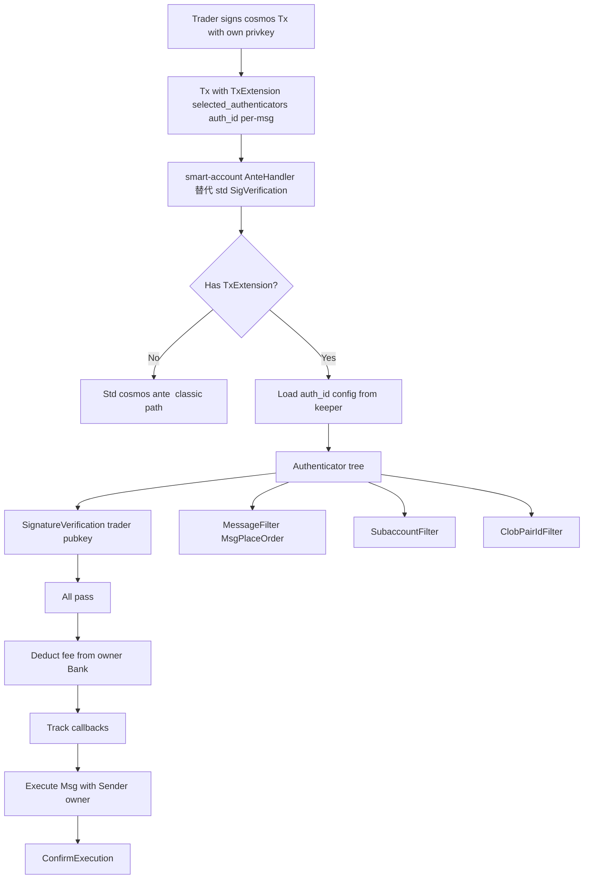

# 调研结论

## 1. zk-dex/lib 的 API key 机制

> 源码位置：`/Users/lyqingye/workspace/me/zk-dex/lib`（只读调研）

### 1.1 数据结构（极简）

```rust
// lib/src/types/api_key.rs
pub struct ApiKey {
    pub api_key_index: u8,    // 0..=254 (255 = NIL 保留)
    pub public_key: [u8; 32], // Ed25519 验签公钥
    pub nonce: i64,           // 该 key 下的递增计数器
}
```

仅 3 个字段。**没有 scope、没有过期时间、没有 last_used_at、没有 read-only / withdraw 等权限位**。

### 1.2 槽位与账户的关系

- `Account.api_key_root`（HashOut）只在账户哈希里占位（ZK Merkle 树 8 层），lib 不维护叶子。
- 块处理时用 `HashMap<(i64, u8), ApiKey>` 在内存维护 `current_api_keys`：key = `(owner_account_index, api_key_index)`。
- subaccount 由 `L2CreateSubAccountTx` 在 master 槽位上创建，复制 master 的 `l1_address`；之后 sub 作 `OWNER_ACCOUNT_ID` 发交易时，使用**它自己的 account_index 对应槽位**的 `(api_key_index → ApiKey, nonce)`。

### 1.3 鉴权流程

```rust
// lib/src/block.rs::dispatch_tx!
let signed = if let Some(message_hash) = tx.signing_hash($state) {
    let signature = $sig.expect("signed L2 transaction requires an Ed25519 signature");
    let public_key = tx.signing_public_key($state).expect(...);
    assert!(verify_ed25519(&message_hash, signature, &public_key));
    true
} else { false };
tx.verify($state);
tx.apply($state);
if signed && $state.attributes.get(ATTRIBUTE_TYPE_SKIP_TX_NONCE) == 0 {
    $state.api_key.nonce += 1;
}
```

要点：

1. **签名摘要**：`hash_bytes` = Keccak256，每条 tx 自己定义 `signing_hash` 把 `(tx_type || account_index || api_key_index || ...其它字段... || nonce)` 序列化后 keccak。
2. **验签算法**：Ed25519，公钥来自 `state.api_key.public_key`（特例：`L2ChangePubkeyTx` 用即将登记的新公钥自签）。
3. **nonce ++**：验签通过 + 非 `SKIP_TX_NONCE` 属性时递增。
4. **重放防御**：tx payload 强制带 `nonce`，nonce 单调即防重放；无独立 nonce 字段也无问题（lib 没有 cosmos sequence 概念）。

### 1.4 注册 / 轮转 / 撤销

| 操作 | 路径 | 谁有权 |
|---|---|---|
| 注册 / 轮转 L2 公钥 | `L2ChangePubkeyTx`（新 key 自签） | 已通过 ACL 校验（账户类型允许此 tx_type） |
| 用 L1 EOA 直接绑定 | `L1ChangePubkeyTx`（secp256k1 ECDSA + Keccak 消息，需匹配 `account.l1_address`） | 持有该账户 L1 EOA 私钥者 |
| "撤销" | 写空公钥 → `is_empty()` 失败 → 后续依赖 key 的 tx 拒绝 | 同上两条路径 |

### 1.5 权限模型

- `ApiKey` 本身**无 scope 字段**。
- 实际 ACL = `verify_l2_sender_role`：按 **发送方账户类型**（Treasury / Insurance / Sub / Public Pool / ...）白名单允许哪些 `TX_TYPE_L2_*`。Sub-account 允许：`L2_TRANSFER / L2_WITHDRAW / L2_CREATE_ORDER / L2_CANCEL_ORDER / L2_MODIFY_ORDER / L2_UPDATE_LEVERAGE / ...`（共 ~16 种）。
- 部分交易额外要求 API key 已登记（公钥非空），如 `L2CreateOrderTx`。

### 1.6 与 EOA / secp256k1 的关系：**叠加**

- L2 日常操作走 Ed25519 + 当前 API key 公钥。
- L1 change pubkey 走 secp256k1 ECDSA + Keccak 消息绑定 `l1_address`。
- 不是二选一替代，而是 **L1 兜底注册 + L2 Ed25519 实战**。

---

## 2. perpdex-l1 当前账户 / 鉴权体系

### 2.1 账户模型

| 文件 | 关键定义 |
|---|---|
| `proto/perpdex/account/v1/account.proto` | `message Account` 字段：`account_index / master_account_index / owner_address / account_type / collateral / ...` |
| `x/account/types/keys.go` | `Accounts(0x01)`、`OwnerToIndex(0x02)`、`MasterSubLinkKey(0x03，预留未用)` |
| `x/account/keeper/account.go` | `EnsureMasterAccount` / `CreateSubAccount` / `IsAuthorized` |
| `types/constants.go` | `FirstUserMasterAccountIndex / MinSubAccountIndex / MaxAccountIndex / MasterAccountType / SubAccountType` |

要点：

- master 与 sub **共享 `OwnerAddress`**（sub 创建时直接复制 master 的）。
- `IsAuthorized(signer, account_index)` 当前实现 = 字符串比对 `account.OwnerAddress == signer`。**意味着 master EOA 私钥可以操作旗下任意 sub（perpdex 当前完全没有"committee 内分权"语义）**。
- `MasterSubLinkKey` 已声明 KV 前缀但全仓库无引用，**预留未启用**。

### 2.2 用户 Msg 的鉴权

| Module | Msg | Signer 字段 | 鉴权 |
|---|---|---|---|
| `x/account` | `MsgDeposit` | `sender` | 不走 IsAuthorized；从 sender bank balance 扣 USDC |
| `x/account` | `MsgWithdraw / MsgUpdateMargin / MsgUpdateLeverage / MsgUpdateAccountConfig / MsgUpdateAccountAssetConfig` | `sender` + `account_index` | `IsAuthorized(sender, account_index)` |
| `x/account` | `MsgTransfer` | `sender` + `from / to_account_index` | `IsAuthorized(sender, from_account_index)`；**未校验 to 同 owner** |
| `x/account` | `MsgCreateSubAccount` | `sender` + `master_account_index` | `master.OwnerAddress == sender` |
| `x/matching` | `MsgCreateOrder / MsgCancelOrder / MsgModifyOrder / MsgCancelAllOrders` | `sender` + `account_index` | `IsAuthorized(sender, account_index)` |
| `x/liquidation` | `MsgLiquidate` | `sender` + `victim_account_index` | **未绑定 sender 与 liquidator account**（当前固定 liquidator=0） |
| `x/liquidation` | `MsgDeleverage` | `sender` + `victim/deleverager_account_index` | msg_server 不校验 sender 与二者的关系 |
| `x/oracle` | `MsgBindOracleOperator / MsgUnbindOracleOperator` | `sender == validator_address` | 字符串比对 |
| `x/oracle` | `MsgInjectOracle` | `sender ∈ Providers` 且模式 = WHITELIST | — |
| `x/asset / x/market / params 类` | `authority` | `authority == k.authority` | gov flow |

### 2.3 ante / 签名

- `ante/ante.go` 唯一自定义入口：`NewAnteHandler` = SDK 默认装饰器链 + 尾部 `IBC NewRedundantRelayDecorator`。**无任何自定义 SigVerification、无 perpdex 账户替换逻辑**。
- 标准 `x/authz` / `cosmossdk.io/x/feegrant` 已注册（`app/keepers/keepers.go`、`app/modules.go`）。
- 验签链路：`SetPubKeyDecorator → SigVerificationDecorator → IncrementSequenceDecorator`，配合 `AccountKeeper`（`authtypes`）。无自定义 `PubKey`。

### 2.4 现有"委托密钥 / Operator / Permission"雏形

| 位置 | 名称 | 说明 |
|---|---|---|
| `x/account` | — | **无** delegated key / scope / 过期字段 |
| `x/oracle` | `OracleOperatorAddress`、`ValidatorOracleBinding`、`OperatorIdx` | 验证人绑定预言机操作者，与 perpdex `Account` 无关 |
| `x/oracle` | `OracleProvider` + `MsgInjectOracle.sender` | 白名单 provider 权限，与 subaccount 无关 |
| `types/constants.go` | `InsuranceFundOperatorAccountIdx` 等 | 仅是常量索引名，不是机制 |

**结论**：perpdex 当前完全没有接近"subaccount 级 API key + scope + 替代 master 验签"的结构；oracle 的 operator/provider 是独立概念。

### 2.5 测试模拟用户

- `tests/e2e/common/users.go` 用 `secp256k1.GenPrivKey()` 生成；`AccountIndex` 由后续业务填充。
- `tests/e2e/msg/*.go` 直接 `keeper.NewMsgServerImpl(...).Xxx(ctx, msg)`，把 `user.Address.String()` 填到 `Sender`。
- **绕过 ante**：不组 Tx、不签名。所以现有 e2e 不能验证签名验证 / fee 扣费 / nonce 校验路径。

---

## 3. dydx v4 / Osmosis `x/smart-account` 的 Authenticator 框架

> 来源：[dydx 官方文档](https://docs.dydx.xyz/interaction/permissioned-keys)、[Osmosis smart-account README](https://github.com/osmosis-labs/osmosis/blob/main/x/smart-account/README.md)、相关 PR（dydx [#2256](https://github.com/dydxprotocol/v4-chain/pull/2256) / [#2183](https://github.com/dydxprotocol/v4-chain/pull/2183) / [#2870](https://github.com/dydxprotocol/v4-chain/pull/2870)）。

### 3.1 总览



### 3.2 五个核心要点

1. **trader 在 chain 上没有任何地址 / 账户**：`Msg.Signers()` 永远是 owner（一级账户）；trader 只是 owner 在 keeper 里登记的某个 `(authenticator_id, type, config)` 条目里的 pubkey。
   - **彻底绕开"prefix 区分"和"SendRestriction 防误转"问题**——trader 没有地址可以收钱。
2. **每个 owner 有一棵 authenticator 树**：通过 `AllOf` / `AnyOf` 组合 `SignatureVerification` / `MessageFilter` / `SubaccountFilter` / `ClobPairIdFilter` / `CosmwasmAuthenticator` 子节点。
   - dydx 的"Permissioned API Key" = `AllOf(SignatureVerification(traderPub), MessageFilter("MsgPlaceOrder"), SubaccountFilter(N))`。
3. **Tx 通过 `TxExtension { selected_authenticators: [auth_id, ...] }`（每个 Msg 一个 `auth_id`）选择走哪条路径**。
   - 无 extension → 走 cosmos 标准 ante（classic auth）。
   - 有 extension → 走 smart-account ante，**替代** cosmos `SigVerificationDecorator`。
4. **fee 从 owner 的 Bank balance 扣**（owner = first signer = fee payer）；**nonce 用 owner 的 `Account.Sequence`**，多 trader 共享 owner sequence。
   - dydx 通过 short-term order 的特殊路径绕开 sequence 竞争（高频订单不走 sequence）。
   - dydx 也有 `TimestampNonce` 的扩展（一种 authenticator 子节点）维护独立 nonce。
5. **5-hook 接口**：

   ```go
   type Authenticator interface {
       Type() string
       StaticGas() uint64
       Initialize(config []byte) (Authenticator, error)
       Authenticate(ctx, request AuthenticationRequest) error  // 验证（state changes 丢弃）
       Track(ctx, request AuthenticationRequest) error          // 记录（commit 即使 msg 失败）
       ConfirmExecution(ctx, request AuthenticationRequest) error // post-handler 后置规则
       OnAuthenticatorAdded(ctx, account, config, id) error
       OnAuthenticatorRemoved(ctx, account, config, id) error
   }
   ```

   配合 `AuthenticatorManager` 注册 type、`Keeper` 维护 (owner, auth_id, type, config) 关联。

### 3.3 已有的子 authenticator 类型

- `SignatureVerification`（必须存在于每棵树里）— stored config = trader pubkey
- `AllOf` / `AnyOf` / `PartitionedAllOf`（组合）
- `MessageFilter` — JSON pattern 匹配 grpc msg type 与字段
- `SubaccountFilter`（dydx 特化）
- `ClobPairIdFilter`（dydx 特化）
- `CosmwasmAuthenticator` — 全自定义（cosmwasm 合约实现 5 个 hook）
- `AuthnVerification` — WebAuthn passkey

### 3.4 重要约束

- 每个 Msg 只能有一个 signer（cosmos sdk 0.50+ 强制）。
- fee payer 必须是第一笔 Msg 的第一个 signer。
- `maximum_unauthenticated_gas` 限制：fee payer 通过认证之前消耗的 gas 上限（防 cosmwasm authenticator 攻击）。
- 模块带 circuit breaker：`is_smart_account_active` 关闭即退化到 cosmos 标准认证。

### 3.5 tx_extension 的关键 proto

```proto
message TxExtension {
  repeated uint64 selected_authenticators = 1;
}
```

放在 `auth.tx.v1beta1.AuthInfo.tx_extension_options` 里（cosmos sdk 标准 extension 槽）。

### 3.6 Permissioned API Key 端到端流程（dydx 文档原文场景）

1. owner 生成 trader keypair（API Wallet Address + Private Key）。
2. owner 发 `MsgAddAuthenticator`：

   ```python
   auth = Authenticator.compose(AllOf, [
       Authenticator.signature_verification(trader_key),
       Authenticator.message_filter("/dydxprotocol.clob.MsgPlaceOrder"),
   ])
   await node.add_authenticator(wallet, auth)
   ```

   返回 `authenticator_id`。
3. owner 把 `authenticator_id` + trader 私钥给 trader。
4. trader 用 trader 私钥构造 cosmos Tx，`tx_extension_options` 携带 `selected_authenticators=[auth_id]`，`Msg.Sender = owner.address`。
5. smart-account ante 加载 `(owner, auth_id)` 树，验 trader signature → 通过 → fee 从 owner Bank 扣 → 执行 Msg（msg_server 看到的 Sender 仍是 owner）。
6. owner 撤销：`MsgRemoveAuthenticator`。

### 3.7 与 perpdex 的兼容性

- **现有 Msg proto 完全不动**（owner 字段保持是 owner）。
- **现有 `IsAuthorized` 完全不动**（msg_server 看到的 sender 是 owner）。
- 只在 ante 层引入 smart-account；fee deduct 也由 smart-account 自己处理。
